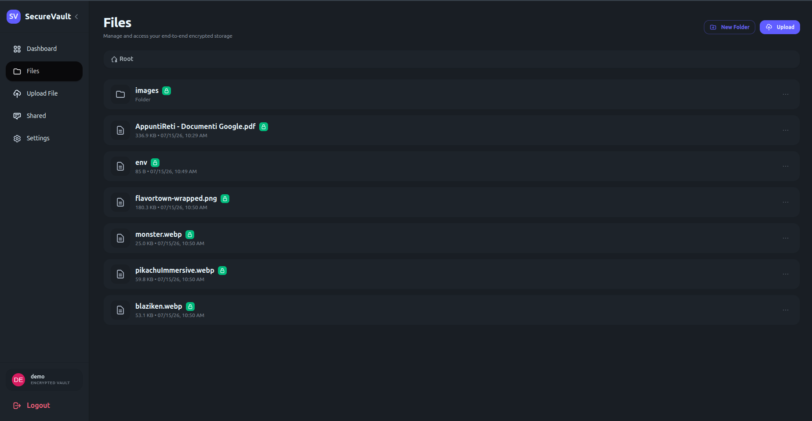

# SecureVault — Encrypted File Storage

End-to-end encrypted file storage. Files and their names are encrypted in the browser; the
server only ever stores ciphertext.
With SecureVault you can store your files securely, organize them in folders, and share them
with other users, all while keeping absolute privacy.

**🔗 Live demo:** https://securevault.alessio.hackclub.app

**Try it instantly — demo account:**
- **Username:** `demo`
- **Password:** `SecureVaultDemo2026`

_Or register with your own email → click the verification link we send you → log in._



## Features
- JWT auth
- Email verification (real, via SMTP)
- E2EE files & folders
- sharing user → user (asymmetric, per-file key)
- public share links
- folders (nested) + breadcrumbs
- previews (images, PDF, text)
- storage quota
- drag & drop

## Stack
- Java Spring Boot
- Angular (SSR)
- PostgreSQL
- local filesystem blob storage
- TailwindCSS + DaisyUI
- nginx (reverse proxy)
- Mailpit (dev SMTP catcher)

## Running the project

### With Docker (recommended)

```bash
docker compose up -d --build
```

This starts everything behind a single reverse proxy:

| Service | URL | Notes |
|---------|-----|-------|
| App (nginx proxy) | http://localhost:4205 | frontend + API under `/api` |
| Mailpit (dev SMTP) | http://localhost:8025 | optional — inspect reset/share emails locally |

Open http://localhost:4205 and register. You'll receive a verification email — in the default dev
setup it's caught by Mailpit at http://localhost:8025; click the link, then log in.

### Running locally without Docker

- **Backend:** copy `backend/src/main/resources/application-example.yml` to `application.yml`,
  fill in the database and SMTP settings, then `cd backend && ./gradlew bootRun` (requires JDK 25
  and a running PostgreSQL).
- **Frontend:** `cd frontend && npm install && npm start` (dev server on http://localhost:4200).
  The API base URL is configured in `frontend/src/environments/environment.ts`.

## Configuration

Set via environment variables (see `docker-compose.yml`):

| Var | Purpose |
|-----|---------|
| `JWT_SECRET` | secret for signing JWTs (use a long random value) |
| `JWT_EXPIRATION` | token lifetime in ms (default `3600000` = 1h) |
| `DB_USERNAME` / `DB_PASSWORD` | PostgreSQL credentials (username defaults to `postgres`) |
| `FRONTEND_URL` | base URL used in email links |
| `PROXY_PORT` | host port the reverse proxy is published on (default `4205`) |
| `SMTP_HOST` / `SMTP_PORT` / `SMTP_USER` / `SMTP_PASSWORD` | mail relay (Mailpit in dev; a real SMTP relay in prod) |
| `SMTP_AUTH` / `SMTP_STARTTLS` | set to `true` for a real SMTP server |

For production email (verification, password reset, share notifications), point the `SMTP_*`
variables at a real relay — the code is already wired for it.

## Security

SecureVault is genuinely end-to-end encrypted: encryption and decryption happen in the browser,
and the server only ever stores ciphertext and wrapped keys it cannot unwrap. Each file has its
own random key; sharing wraps that key to the recipient's RSA public key, so the server never
sees a key in cleartext and a shared file exposes only itself.

See **[SECURITY.md](./SECURITY.md)** for the full key-management design (envelope encryption,
per-file keys, RSA sharing, recovery key, and password reset).

## Status

**Done:** auth + email verification, E2EE for file contents and names, per-file keys wrapped by a
master key, user → user sharing (RSA) and public share links, previews, storage quota,
password reset via a recovery key (no data loss), and **real transactional email in production**
via an SMTP relay (verification, password reset and share notifications are actually delivered).

**Partial / future:** Content-Security-Policy (currently report-only, to be enforced) and
automated crypto tests.
