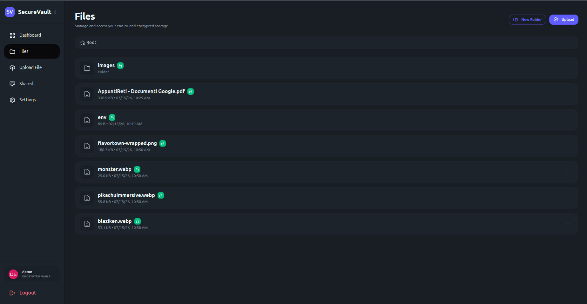

# SecureVault — Encrypted File Storage

End-to-end encrypted file storage. Files and their names are encrypted in the browser; the
server only ever stores ciphertext.
With SecureVault you can store your files securely, organize them in folders, and share them
with other users, all while keeping absolute privacy.

**🔗 Live demo:** https://securevault.alessio.hackclub.app

**Try it instantly — demo account:**
- **Username:** `demo`
- **Password:** `SecureVaultDemo2026`

_Or register with your own email → click the verification link we send you → log in._



## Features
- JWT auth
- Email verification (real, via SMTP)
- E2EE files & folders
- sharing user → user (asymmetric, per-file key)
- public share links, with an optional expiry (24h / 7d / never)
- folders (nested) + breadcrumbs
- previews (images, PDF, text)
- storage quota (1 GB per account)
- drag & drop

## Stack
- Java Spring Boot 4 (JDK 25)
- Angular (SSR)
- PostgreSQL
- local filesystem blob storage
- TailwindCSS + DaisyUI
- nginx (reverse proxy)
- Mailpit (dev SMTP catcher)

## Running the project

### With Docker (recommended, on a normal machine)

```bash
cp .env.example .env     # then fill in the values
docker compose up -d --build
```

This starts everything behind a single reverse proxy:

| Service | URL | Notes |
|---------|-----|-------|
| App (nginx proxy) | http://localhost:4205 | frontend + API under `/api` |
| Mailpit (dev SMTP) | http://localhost:8025 | optional — inspect reset/share emails locally |

The proxy waits for the backend healthcheck before it starts, so the first request
after `up` gets the app and not a 502. The JVM takes up to a minute to come up.

Open http://localhost:4205 and register. You'll receive a verification email — in the default
dev setup it's caught by Mailpit at http://localhost:8025; click the link, then log in.

### Deploying to a small VPS (2 GB RAM)

**Do not run `--build` there.** The Angular build makes esbuild exceed the available memory and
the OOM killer stops it (and on ZFS you cannot add a swapfile). Build the images where you have
RAM, ship them over SSH:

```bash
# locally
docker compose build frontend proxy
docker save rila-frontend rila-proxy | gzip | \
  ssh <user>@<host> 'gunzip | docker load'

# on the VPS
cd /root/securevault
git pull
docker compose up -d          # no --build
```

The backend image is small enough to build on the VPS, but shipping it the same way costs
nothing. Check that the architectures match (`uname -m` on both ends).

The `SMTP_*` variables are read at runtime: changing them needs a `docker compose up -d`, not a
rebuild.

### Backups

The two named volumes (`postgres_data`, `securevault_storage`) survive a reboot, but nothing
copies them anywhere. [`deploy/backup.sh`](deploy/backup.sh) dumps the database and tars the
encrypted blobs, keeping 7 days. Install it on the VPS:

```bash
install -m 700 deploy/backup.sh /root/securevault/backup.sh
crontab -e     # 30 3 * * * /root/securevault/backup.sh >> /root/backups/backup.log 2>&1
```

Restore is worth testing once, otherwise you do not know the backup is any good:

```bash
docker exec securevault_postgres createdb -U postgres securevault_restore_test
gunzip -c /root/backups/db_XXXX.sql.gz | \
  docker exec -i securevault_postgres psql -U postgres -d securevault_restore_test
```

### Running locally without Docker

- **Backend:** copy `backend/src/main/resources/application-example.yml` to `application.yml`,
  fill in the database and SMTP settings, then `cd backend && ./gradlew bootRun` (requires JDK 25
  and a running PostgreSQL).
- **Frontend:** `cd frontend && npm install && npm start` (dev server on http://localhost:4200).
  The API base URL is configured in `frontend/src/environments/environment.ts`.

## Configuration

Set via environment variables — copy `.env.example` to `.env` and fill it in (see also
`docker-compose.yml`):

| Var | Purpose |
|-----|---------|
| `JWT_SECRET` | secret for signing JWTs (use a long random value) |
| `JWT_EXPIRATION` | token lifetime in ms (default `3600000` = 1h) |
| `DB_USERNAME` / `DB_PASSWORD` | PostgreSQL credentials (username defaults to `postgres`) |
| `FRONTEND_URL` | base URL used in email links, and the CORS origin |
| `PROXY_PORT` | host port the reverse proxy is published on (default `4205`) |
| `SMTP_HOST` / `SMTP_PORT` / `SMTP_USER` / `SMTP_PASSWORD` | mail relay (Mailpit in dev; a real SMTP relay in prod) |
| `SMTP_AUTH` / `SMTP_STARTTLS` | set to `true` for a real SMTP server |

`FRONTEND_URL` is not cosmetic: `SecurityConfig` builds the allowed CORS origins from it, so a
wrong value makes registration fail with a 403.

A repeated key in `.env` is won by the last one, silently — if a setting seems to be ignored,
check the file for a second block further down.

## Tests

```bash
cd backend && ./gradlew test     # H2 in memory, no Docker needed
cd frontend && npm test          # CryptoService round-trips
```

The backend suite covers authorization on files: another user's file must not be downloadable,
renamable, deletable, publishable or unpublishable, and an expired or revoked public link must
behave exactly like one that never existed.

## Security

SecureVault is genuinely end-to-end encrypted: encryption and decryption happen in the browser,
and the server only ever stores ciphertext and wrapped keys it cannot unwrap. Each file has its
own random key; sharing wraps that key to the recipient's RSA public key, so the server never
sees a key in cleartext and a shared file exposes only itself. Public links carry the file key
in the URL fragment, which browsers never send to the server.

See **[SECURITY.md](./SECURITY.md)** for the full key-management design (envelope encryption,
per-file keys, RSA sharing, recovery key, and password reset).

## Status

**Done:** auth + email verification, E2EE for file contents and names, per-file keys wrapped by
a master key, user → user sharing (RSA) and public share links with an optional expiry,
previews, storage quota, password reset via a recovery key (no data loss), and an enforced
Content-Security-Policy.

**Not done:** a trash bin for deleted files (a delete is immediate and final), search over file
names, two-factor authentication, and an audit log of accesses.


Thank you for reading this, I hope you like the project :)
