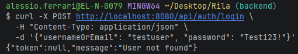
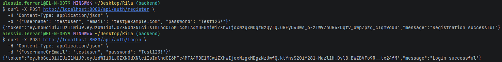

# Step 1
Fatto init del backend, testato rotte, testato comunicazione con frontend.
Dockerizzato l'applicazione, usato il db e via dicendo

# Step 2
Cominciato con il modello dei dati del db
Creata entità User
Creati i campi base dell'entità
- id
- username
- email
- password
- roles

Creato user repository, contenente i metodi per comunicare con il db

Creato anche dentro il security Config un metodo easy per criptare le password

# Step 3
Creati i 3 dto
- Auth response con campi vari
- Login request con i campi
- Register request con i campi

Creato lo user service contenente due metodi utili poi per il controller

Creato l'auth controller, contenente due endpoint per il login e la registrazione.
/api/auth/login
/api/auth/register

# Step 4
Auth stateless
Creazione Jwt Service
Aggiunta metodi
- generateToken
- extractUsername
- isTokenValid

Implementato il token vero dentro il /login e il /registration

# Step 5
Filtro per intercettare ogni richiesta e verificare che contenga il token

Tests

